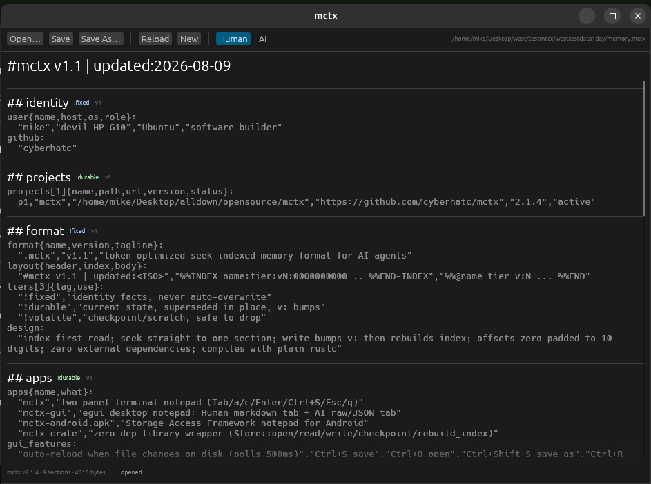
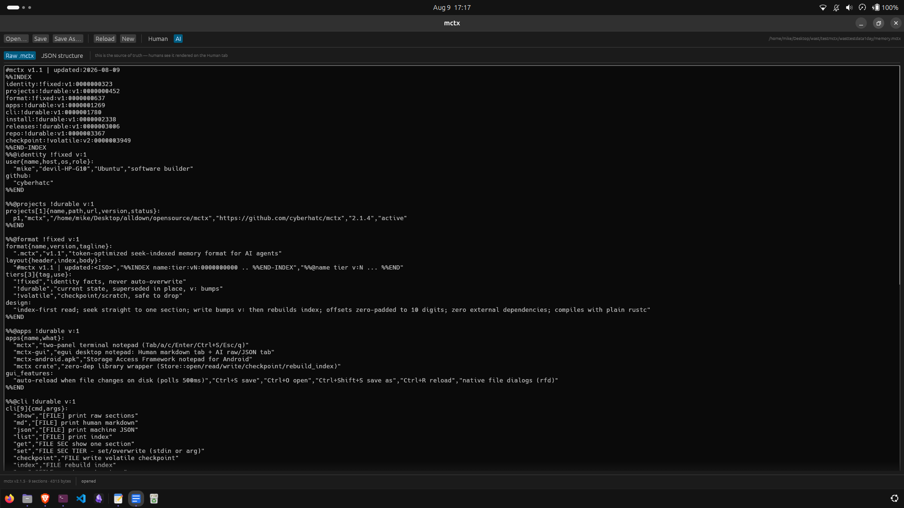

<div align="center">

# mctx — Memory Context

### One file. Two minds. Yours and your AI's.

**mctx** is a token-optimized, seek-indexed memory format for AI agents, shipped
with a **desktop app**, a **terminal notepad**, an **Android app**, and a
**zero-dependency Rust library**. It is the bridge between a human who thinks in
paragraphs and an agent that thinks in byte offsets.

[](https://github.com/cyberhatc/mctx/releases)
[](#license)
[](#)
[](#)

</div>

---

## Table of contents

- [The idea](#the-idea)
- [Screenshots](#screenshots)
- [Why mctx?](#why-mctx)
- [The format](#the-format)
- [What's in the box](#whats-in-the-box)
- [Installation](#installation)
- [Quick start](#quick-start)
- [Usage](#usage)
- [Build & test](#build--test)
- [License](#license)

---

## The idea

Every AI agent forgets the moment the chat closes. And when it does remember, it
usually writes sprawling JSON blobs nobody can read — and a third of every token
is punctuation noise.

`.mctx` is the opposite: a memory file so cheap to read that an agent reads the
**whole thing every session**, and so fast to navigate that it can `seek`
straight to a single section. You open the same file in a friendly app and see
exactly what your agent sees — no translation, no mystery.

> **Format philosophy:** a memory file should be *priced like a sticky note* and
> *structured like a filing cabinet*.

---

## Screenshots

Two views, one truth. The desktop notepad renders the same file as **readable
Markdown** for you and **raw `.mctx` source + JSON breakdown** for your agent.

| Human tab — rendered Markdown, easy on the eyes | AI tab — raw `.mctx` source + JSON breakdown |
|:---:|:---:|
|  |  |

---

## Why mctx?

- **Token-optimized** — a seek-indexed flat format with minimal punctuation.
  One section = one `%%@name tier v:N` block. No braces, no quoting noise.
- **Fast to seek** — the `%%INDEX` block is a map at the top of the file; an
  agent jumps straight to any section instead of parsing everything.
- **Human + AI readable** — the same file renders as Markdown for you and as raw
  `.mctx` + JSON for the agent. Same file, two minds.
- **Zero dependencies** — the core library compiles with plain `rustc`. No
  `serde`, no `serde_json`, no build script, no vendored blobs.
- **Live sync** — the desktop app watches the file and reloads automatically
  when your agent writes new memory.

---

## The format

```mctx
#mctx v1.1 | updated:2026-08-08
%%INDEX
identity:!fixed:v1:0000000058
projects:!durable:v2:0000000134
%%END-INDEX
%%@identity !fixed v:1
user{alias,role}:
  "devil2","student/builder"
%%END
```

Think of it like a book: the **`%%INDEX`** is the table of contents, each
**`%%@section`** is a chapter, and the **tier** tells the agent whether a
chapter is *carved in stone*, *living*, or *scratch paper*:

| Tier | Meaning | Agent's rule |
|---|---|---|
| `!fixed` | Identity — who you are | Never auto-overwrite |
| `!durable` | Current state — what's true now | Supersede in place, bump `v:` |
| `!volatile` | Checkpoint — scratch notes | Safe to drop, short-lived |

Every byte offset is zero-padded to 10 digits so the index's own length never
depends on its values — no circular traps. Bodies are TOON-style tabular arrays
or plain `key: value` lines: minimal punctuation, cheap for an LLM to read.

See [doc/mctx-spec.md](doc/mctx-spec.md) for the full specification.

---

## What's in the box

| Component | What it is |
|---|---|
| **`src/mctx.rs`** | The format library. Zero deps, `rustc`-only. Load the index, seek to a section, write with a `v:` bump, rebuild. |
| **`apps/mctx-gui`** → `mctx-gui` | Desktop notepad (egui). **Human** tab (Markdown) + **AI** tab (raw + JSON). Auto-reloads when the file changes on disk. |
| **`apps/mctx-notepad`** → `mctx` | Two-panel terminal editor, plus an agent/script CLI: `show`, `md`, `json`, `list`, `get`, `set`, `checkpoint`, `index`, `new`. |
| **`android/`** → `mctx-android.apk` | A notepad for `.mctx` files on the go (Storage Access Framework). |
| **`mctx/`** | Cargo wrapper so the single-file library is a normal crate dependency. |

---

## Installation

Prebuilt binaries for **Linux, Windows, macOS and FreeBSD** (plus a `.deb` and an
Android APK) are attached to every
[GitHub Release](https://github.com/cyberhatc/mctx/releases).

### One-liner (any OS)

```bash
curl -sSL https://raw.githubusercontent.com/cyberhatc/mctx/main/scripts/install.sh | bash
```

Installs both `mctx` and `mctx-gui`, and registers the `application/x-mctx`
MIME type so `.mctx` files open in the app straight from your file manager.

### Package managers

| Platform | Command |
|---|---|
| **Debian / Ubuntu** | `bash scripts/build-deb.sh` → `target/mctx_2.1.5_amd64.deb`, then `sudo apt install ./mctx_2.1.5_amd64.deb` |
| **Homebrew (macOS/Linux)** | `brew install cyberhatc/mctx/mctx` |
| **Windows** | grab `mctx-windows-x86_64.exe` and `mctx-gui-windows-x86_64.exe` |
| **FreeBSD** | port skeleton in `pkg/freebsd/` |
| **Android** | side-load `mctx-android.apk`, or `pkg install rust && cargo install --path apps/mctx-notepad` in Termux |
| **Agent skill** | `bash scripts/install-skill.sh` installs `skills/mctx` into `~/.config/opencode/skills/` and `~/.claude/skills/` so agents learn the read/write/checkpoint protocol globally |

---

## Quick start

```bash
# create a fresh memory file and open it
mctx new ~/memory.mctx
mctx-gui ~/memory.mctx

# drop a checkpoint from any script
printf 'next: fix the bug\n' | mctx checkpoint ~/memory.mctx -

# read it back the way an agent would
mctx json ~/memory.mctx
```

---

## Usage

### Desktop app — for the humans

```
mctx-gui [memory.mctx]   # open a file, or use Open… / Save As…
```

- **Human** tab: memory rendered as readable Markdown.
- **AI** tab: raw `.mctx` source plus a structured JSON breakdown.
- `Ctrl+S` save · `Ctrl+O` open · `Ctrl+Shift+S` save as · `Ctrl+R` reload.
- The app **watches the file and reloads automatically** when it changes on disk
  — if your agent writes new memory while you're looking at it, the view updates
  live. No refresh key needed.

### Terminal notepad — for the quick jot

```
mctx [memory.mctx]      # default: ./memory.mctx (created if missing)
```

Keys: `Tab` switch panel · `a` add section · `c` checkpoint · `Enter` edit ·
`Ctrl+S` save · `Esc` back · `q` quit (safe while unsaved).

### Agent mode — for the machines

```
mctx show FILE                  raw .mctx
mctx md FILE                    human-readable Markdown
mctx json FILE                  AI view: structured JSON (sections/tiers/v/offsets)
mctx list FILE                  index rows
mctx get FILE SECTION           one section's body
mctx set FILE SECTION TIER BODY write a section (bumps v:); BODY '-' = stdin
mctx checkpoint FILE BODY       write the !volatile checkpoint; '-' = stdin
mctx index FILE                 rebuild the %%INDEX after hand edits
mctx new FILE                   create a fresh file
```

---

## Build & test

```bash
cargo build --release               # builds target/release/mctx + mctx-gui
cargo test --release                # unit + library tests
cargo clippy --release --all-targets
rustc --edition 2021 -D warnings -O -o /tmp/mctx_test src/test_mctx.rs && /tmp/mctx_test
```

See [man/mctx.1](man/mctx.1) and `apps/mctx-notepad/src/main.rs` for details.

---

## License

Licensed under either of **MIT** or **Apache-2.0**, at your option.

---

<div align="center">

> *Built for humans and AI agents to share the same memory.*

[Report a bug](https://github.com/cyberhatc/mctx/issues) · [Releases](https://github.com/cyberhatc/mctx/releases)

</div>
